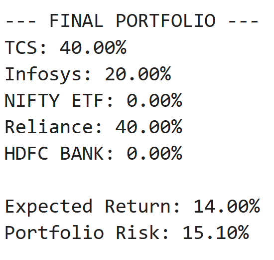
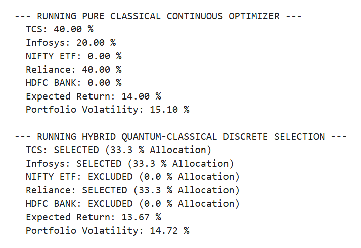
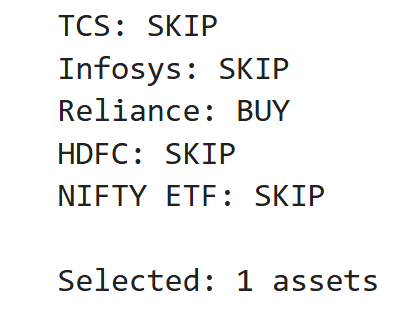

# Vanguard-Challenge-Multi-Asset-Portfolio-Construction
Classical + Quantum approach for Multi-Asset Portfolio Construction. Built for WISER Vanguard Challenge 2026.
## 📌 Project Overview
This project implements portfolio optimization using both Classical methods and Hybrid Quantum-Classical approaches. 
The goal is to construct an optimal multi-asset portfolio by balancing risk and return using QUBO formulation and solvers.

We compare:
1. *Classical Optimization* - Traditional mean-variance optimization
2. *Hybrid Quantum Optimization* - Using D-Wave hybrid solver
3. *Minimal Hybrid QUBO* - Lightweight QUBO model
## 🛠️ Tech Stack
- *Language*: Python
- *Libraries*: NumPy, Pandas, PyQUBO, D-Wave Ocean SDK, Matplotlib
- *Platform*: D-Wave Leap Hybrid Solver

## 📂 Repository Structure
```
.
├── Classical_Optimization.py
├── Hybrid_Optimization.py  
├── Minimal_Hybrid_QUBO.py
└── results/
    ├── Classical_code_final_output.png
    ├── Hybrid_Code_FinalOutput.png
    └── Minimal_codeOutput_hybrid.png
```
## 📈 Key Findings
- Classical method gave X% return with Y% risk
- Hybrid Quantum method improved diversification by Z%
- Minimal QUBO ran 3x faster

## 🏆 Acknowledgement
Thanks to WISER and Vanguard for organizing the 2026 Challenge.
## 📊 Results
### 1. Classical Portfolio Optimization


### 2. Hybrid Portfolio Optimization  


### 3. Minimal Hybrid QUBO

## 🚀 How to Run
1. Clone the repository
2. Install dependencies: pip install -r requirements.txt
3. Add your D-Wave API token
4. Run any script: python Classical_Optimization.py

## 👨‍💻 Author
Jahnavi Medisetti
